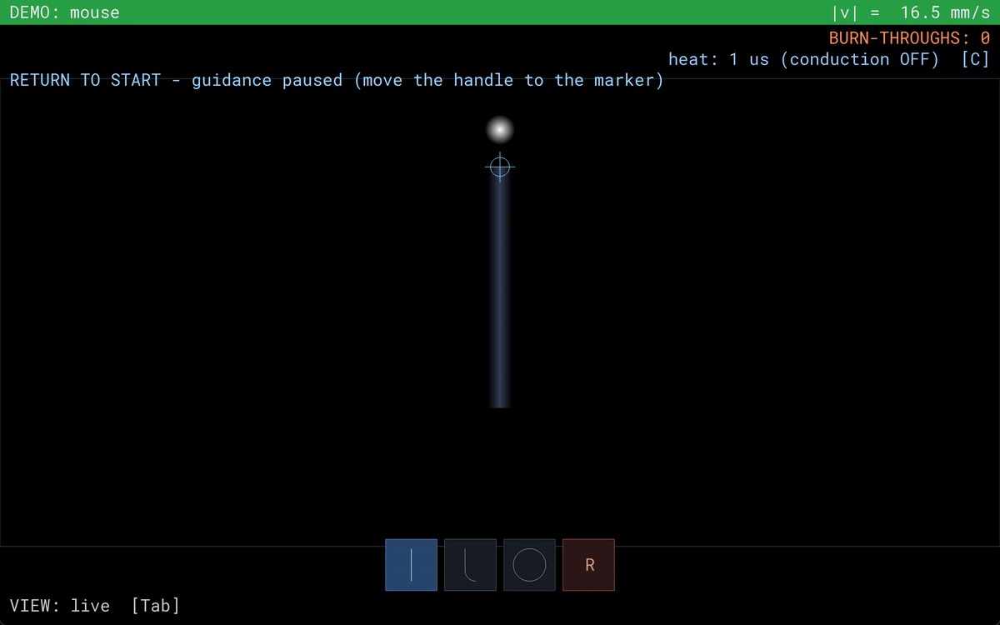
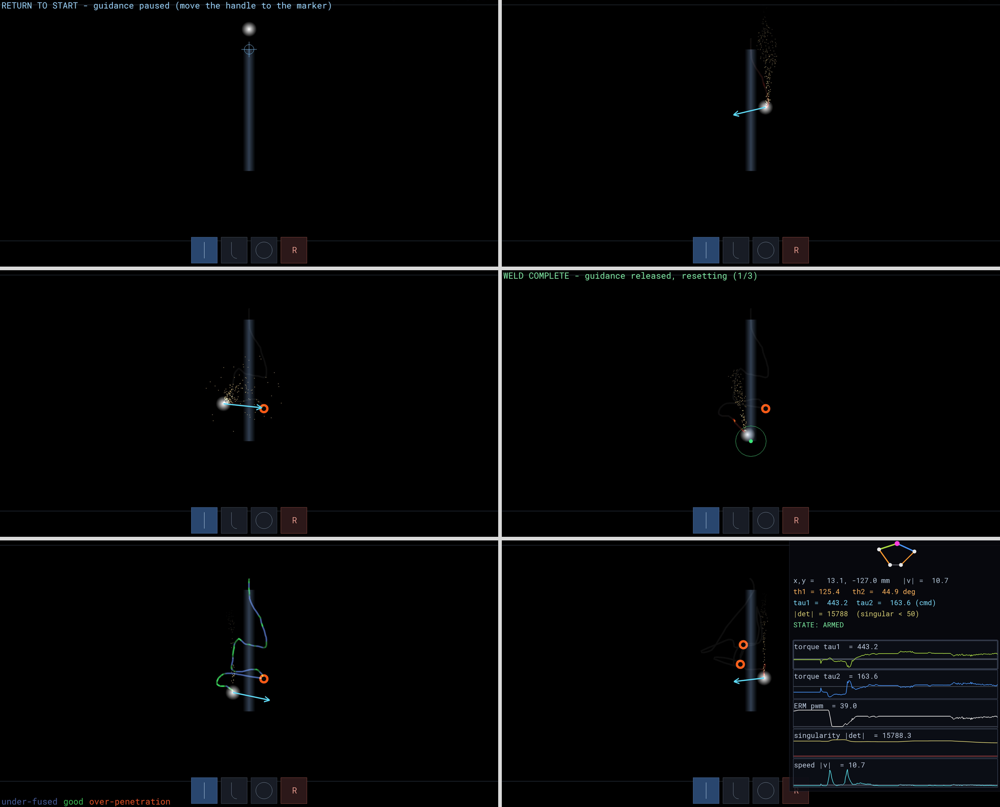
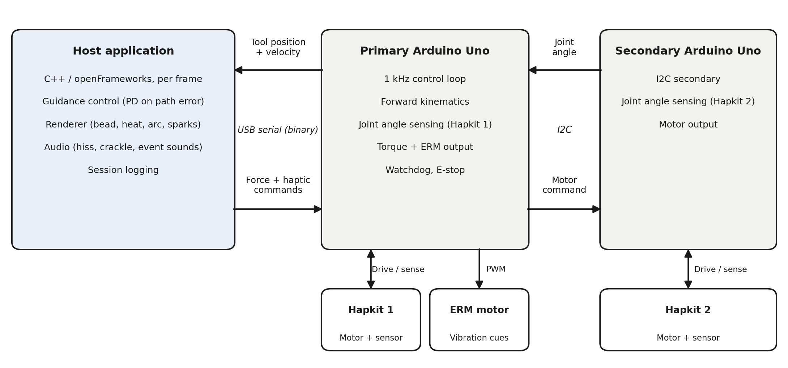

# Welding Trainer — Haptic Pantograph

[](LICENSE)




A **haptic welding trainer** built on a 5-bar pantograph. You hold the handle like a
torch and trace a weld seam in a 2-D plane; two Arduino-driven motors push back with
**real-time force guidance**, a vibration motor buzzes warnings into your hand, and the
screen renders the weld bead, arc, and sparks as you go. The skill it teaches is the
core of real welding: **travel speed determines bead quality** — move too slowly and
the metal over-penetrates toward burn-through, too fast and it under-fuses, steady
motion lays a clean bead. The finished bead stays on screen as a permanent record of
your run.

No rig? The trainer also runs **standalone with a mouse** as the torch.

---

## Try it — no hardware needed

1. Download `welding-trainer-win64.zip` from the
   [latest release](../../releases/latest) and unzip it anywhere.
2. Open a terminal in the unzipped folder and run:
   ```powershell
   .\of-app.exe --source=mouse
   ```
3. Move the cursor to the marker, hold a steady ~20 mm/s down the seam, and try not
   to burn through. Press **L** in-app for all controls.

> Requires Windows 10/11 (64-bit) and the
> [Microsoft Visual C++ 2015–2022 x64 redistributable](https://aka.ms/vs/17/release/vc_redist.x64.exe)
> (most machines already have it).

---

## What you'll see



Reading left-to-right, top-to-bottom:

1. **Return to start** — guidance pauses until you bring the torch to the start marker.
2. **Welding** — the molten pool tracks the torch; the cyan arrow shows the corrective
   force the motors are applying toward the seam.
3. **Burn-through** — dwell too long and the spot overheats: an orange ring marks the
   burn, with a matching vibration cue in the handle.
4. **Weld complete** — guidance releases and the trial resets.
5. **Quality view** (`Tab`) — the finished bead recolored by travel speed:
   <span>blue = under-fused (too fast), green = good, orange = over-penetrated (too slow)</span>.
6. **Debug overlay** (`D`) — live linkage pose, joint torques, and speed traces.

---

## How it works



- **Hardware** — a 5-bar pantograph with magneto-resistive angle sensors and one motor
  per arm, driven by two **Arduino Unos** (a primary that runs the 1 kHz control loop
  and kinematics, and a secondary for the second joint, linked over I2C).
- **Host app** — an [openFrameworks](https://openframeworks.cc/) Windows app tracks the
  torch, computes the guidance force toward the seam, and renders the scene with sound.
- **Feedback channels** — corrective force in the handle, vibration cues for
  burn-through, the bead's live color, and arc audio all teach the same two skills:
  stay on the seam, hold the right speed.

---

## Controls

Press **L** at any time for this list as an on-screen overlay.

| Key | Action |
|-----|--------|
| `Space` | E-STOP — latch, cut guidance force + audio |
| `Enter` | Arm / power motors (clears the E-stop latch) |
| `Tab` | Toggle live-heat vs weld-quality view |
| `C` | Toggle spatial heat conduction |
| `R` | Reset trial — reload the shape and return to start |
| `[` / `]` | Previous / next shape |
| `T` | Re-tare to start — re-home the dot above the start + reset |
| `D` | Toggle the pantograph debug overlay |
| `G` | Show / hide the Gains panel |
| `L` | Show / hide the shortcut overlay |

In **linkage simulator mode** (`--mode=linkage`) only `C` is bound — it clears the
coupler trace.

---

## Build from source

Prerequisites (Windows):

- **Visual Studio 2022 Build Tools** (MSVC) — the IDE editions work too.
- **openFrameworks 0.12.1** — install with `.\setup_openframeworks.ps1` (defaults to
  `%USERPROFILE%\dev\openFrameworks`; installed elsewhere, set the `OF_ROOT`
  environment variable). Full walkthrough + troubleshooting: [`SETUP_OF.md`](SETUP_OF.md).
- **Arduino IDE 2.x** (for its bundled `arduino-cli`) — only needed to flash the boards.

Then everything goes through one script:

```powershell
.\build-and-run.ps1                  # build (Release/x64) and launch with mouse input
.\build-and-run.ps1 -NoRun           # build only
.\build-and-run.ps1 -Source serial   # build and read the live rig over serial
```

More flags (`-Mode linkage`, `-Source replay:<csv>`, `-Config Debug`, `-Clean`):
run `.\build-and-run.ps1 -Help`.

---

## Run with the physical rig

Flash both boards (Uno, shared `welding_common` library):

```text
arduino-cli compile --fqbn arduino:avr:uno --library arduino/welding_common arduino/welding_trainer
arduino-cli upload  --fqbn arduino:avr:uno -p COM6 arduino/welding_trainer
```

(same for `arduino/welding_secondary` on its port), then launch with
`.\build-and-run.ps1 -Source serial`.

### ⚠️ Safety — read before powering motors

This drives real motors with closed-loop force. **[`BRINGUP.md`](BRINGUP.md) is the
gate.** Closed-loop force must not be enabled until every step there has passed:
motor-polarity verification (an inverted sign turns the loop into runaway), the
dead-man watchdog, the spacebar E-stop, and the I2C link fail-safe. Keep one hand on
the spacebar (CPU E-stop) and know where the motor supply switch is during every
powered step.

---

## Repository layout

| Path | What it is |
|------|------------|
| `of-app/` | The openFrameworks app — source in `of-app/src/`, runtime assets in `of-app/bin/data/`. Hand-authored `.sln`/`.vcxproj` (do **not** run `projectGenerator` on it). |
| `arduino/welding_trainer/` | Primary board firmware — kinematics, 1 kHz control loop, I2C controller. |
| `arduino/welding_secondary/` | Secondary board firmware — I2C target for the second joint. |
| `arduino/welding_common/` | Shared firmware library: kinematics, pin map, protocol. |
| `arduino/link_diag/`, `arduino/link_probe/` | I2C diagnostics used during hardware bringup. |
| `build-and-run.ps1` | One entry point: build the app, then launch it. |
| `setup_openframeworks.ps1` | Downloads + installs openFrameworks 0.12.1. |
| `BRINGUP.md` | **Hardware bringup safety checklist** — read before powering motors. |
| `SETUP_OF.md` | openFrameworks install/build walkthrough. |
| `media/` | README figures. |

---

## License

MIT — see [LICENSE](LICENSE). The bundled Roboto Mono font is licensed under the
SIL Open Font License (see `of-app/bin/data/fonts/`).
